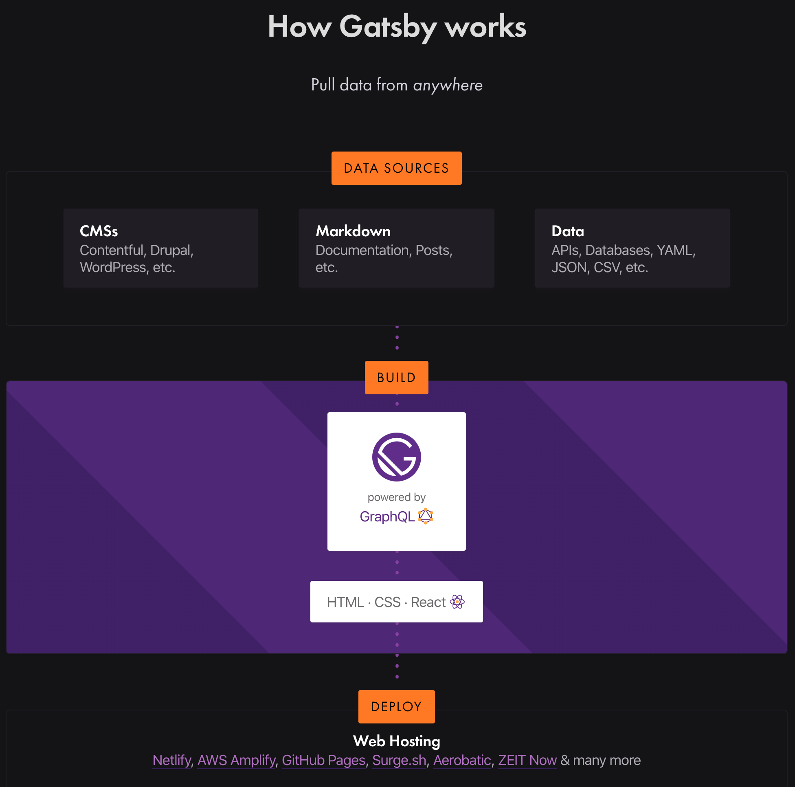

# Gatsby Tutorial

1. 
2. </img>
(Disclaimer: My good friend, Miley Cyrus, has given me explicit permission to use her likeness but just me, please don't put this image out anywhere else ok thanks)

## Overview



## Getting Started

[GatsbyJS Homepage](https://www.gatsbyjs.org/) | [GitHub Repo](https://github.com/gatsbyjs/gatsby)

>"Gatsby is an extremely flexible, free and open-source React-based JavaScript framework that produces fast websites and apps."

Their website has very informative, detailed [docs](https://www.gatsbyjs.org/docs/), [tutorials](https://www.gatsbyjs.org/tutorial/) and [reference guides](https://www.gatsbyjs.org/docs/guides/) on the majority of Gatsby topics. You can also find [plugins](https://www.gatsbyjs.org/plugins/), [starters](https://www.gatsbyjs.org/starters/?v=2) (both official and community-made) and links to external resources if their site doesn't answer your question. Give it a browse if you have any additional questions or are stuck with anything.

---

**Install Gatsby CLI globally:**

```sh
npm install -g gatsby-cli
```

NOTE: In some instances, you may encounter issues with installing node packages globally, if this happens you can read up on possible fixes [here](https://docs.npmjs.com/resolving-eacces-permissions-errors-when-installing-packages-globally) or [here](https://github.com/sindresorhus/guides/blob/master/npm-global-without-sudo.md).

**You can create a new Gatsby site from a starter URL or GitHub username/repo name:**

```sh
gatsby new [SITE_DIRECTORY] [URL_OF_STARTER_GIT_REPO] || [GITHUB_USER_NAME/REPO]
```

- [SITE_DIRECTORY] - name of your new directory, anything you want
- [URL_OF_STARTER_GIT_REPO] - [https://github.com/gatsbyjs/gatsby-starter-hello-world](https://github.com/gatsbyjs/gatsby-starter-hello-world)
- [GITHUB_USER_NAME/REPO] - gatsbyjs/gatsby-starter-hello-world

**Example:**

`gatsby new jordan-blog gatsbyjs/gatsby-starter-hello-world`
...will produce a Gatsby site in the directory '/jordan-blog' using the hello-world starter.

If you don't specify both arguments, Gatsby CLI will ask you via terminal what the name is and allow you to select from a menu of the three base starters (default, hello-world, blog) or use a different one. If you don't specify a starter origin, it will use the default starter.

**Switch into your new directory:**

```sh
cd [SITE_DIRECTORY]
```

**Run `gatsby develop` to start your development server**

```sh
gatsby develop
```

It will be running on [localhost:8000](localhost:8000) and your GraphQL query sandbox will be at [localhost:8000/___graphql](localhost:8000/___graphql) but we'll get into GraphQL a little later on. If you have any other questions or want to see all the Gatsby CLI commands, you can run `gatsby help` in your terminal or read up on the [CLI docs](https://www.gatsbyjs.org/docs/gatsby-cli/).

If you'd like to view changes on a different device on the same network, you can run:
`gatsby develop -H 0.0.0.0`
and you will get a URL to use on your other device.

Congratulations, you have just birthed a brand new, blazing fast (soon-to-be) **GORGEOUS** Gatsby site. Mazel tov!

---

## Project Structure and Customization

Inside your `/src` folder, is a subfolder called `/pages`. A beautiful feature of Gatsby is the ease of making new pages. If you create a file inside the `/pages` subfolder, Gatsby will automatically generate a new page component with the slug of that filename. You can then travel to `localhost:8000/PAGENAME` and there will be your nice new page.

Open `/src/pages/index.js` and make some changes to the text with your development server running. If you have your windows side-by-side, you can see the change happen right away. Modify your file contents with:

```js
import React from "react"

export default () => (
  <div style={{ color: `purple`, fontSize: `72px` }}>
    <p>I'm purple now Mom, it's not a phase, it's who I am</p>
    
  </div>
)
```

(The `img` tag will add a random Unsplash image with the specified dimensions)

**Props and creating a new page:**

Create a new folder `/src/components` with a `header.js` file and inside:

```js
import React from "react"

export default props => <h1>{props.headerText}</h1>
```

Create a new page file: `/src/pages/about.js` and inside:

```js
import React from "react"
import Header from '../components/header'

export default () => (
  <div style={{ color: `teal` }}>
    <Header headerText="Some header text" />
    <p>Tight. Dope. Not whack, probably.</p>
  </div>
)
```

Go to `localhost:8000/about` and see your new page and props in action.

**Navigation:**
Similar to React Router, Gatsby uses a `Link` component for navigation. At the top of your `index.js` file, add the following import statement:

`import { Link } from 'gatsby'`

Inside your `div`, add:

`<Link to="/contact/">Contact</Link>`

There currently isn't a `contact` page in place yet so you should see the Gatsby 404 page. We'll now make a `contact` page and `Link` it to our homepage.

- **contact.js:**

```js
import React from "react"
import { Link } from "gatsby"
import Header from "../components/header"

export default () => (
  <div style={{ color: `teal` }}>
    <Link to="/">Home</Link>
    <Header headerText="Contact" />
    <p>Contact me, if you're into that sort of thing</p>
  </div>
)
```

Keep in mind that the Gatsby `Link` component is for linking between pages within your site. For external links to pages not handled by your Gatsby site, use the regular HTML `a` tag.

**Shared Layout Component:**
Here we'll get into making a `Layout` component which is where our common components will be imported into and then instead of importing X, Y, Z components over and over into different files, you instead just import `Layout` as a wrapper. Here is a basic example. First we'll create a `Nav` and `Footer` component to import into `Layout`.

- **Nav.js:**

```js
import React from 'react'
import { Link } from 'gatsby'

const ListLink = props => (
  <li style={{ display: `inline-block`, marginRight: `1rem` }}>
    <Link to={props.to}>{props.children}</Link>
  </li>
)

export default () => (
  <nav style={{ marginBottom: `1.5rem` }}>
    <Link to="/" style={{ textShadow: `none`, backgroundImage: `none` }}>
      <h3 style={{ display: `inline` }}>My Blog</h3>
    </Link>
    <ul style={{ listStyle: `none`, float: `right` }}>
      <ListLink to="/">Home</ListLink>
      <ListLink to="/about/">About</ListLink>
      <ListLink to="/contact/">Contact</ListLink>
    </ul>
  </nav>
)
```

- **Footer.js:**

```js
import React from 'react'

export default () => (
  <footer>
    Foot stuff
  </footer>
)
```

- **Layout.js:**

```js
import React from 'react'
import Nav from './Nav'
import Footer from './Footer'

export default ({ children }) => (
  <div style={{ margin: `3rem auto`, maxWidth: `650`, padding: `0 1rem` }}>
    <Nav />
    {children}
    <Footer />
  </div>
)
```

- **index.js**

```js
// Imports and everything else

export default () => (
<Layout>
  // Nav

  // This p tag is a {children} prop
  <p>I'm purple now Mom, it's not a phase, it's who I am</p>

  // Also a {children} prop thanks to Layout component
  

  // Footer
)
</Layout>
```

This makes for much cleaner code and saves a lot of typing imports. You should now also go in and wrap all your page component contents with your new `Layout` and see if your page shows the way you expect. Keep in mind your element structure when you use a `Layout` component, you don't want to end up with a ton of nested divs which can make styling difficult.

**Styling:**
We'll touch on the different styling methods used for Gatsby sites. First, make a new folder `/src/styles/` with `global.css` inside. This is the most straightfoward way to implement styles. Inside `global.css`, add:

```css
html {
  background-color: lavender;
}
```

In your project's root directory, add a new file `gatsby-browser.js` in which we'll import our stylesheets. Inside the new file, add:

`import "./src/styles/global.css"`

In this case, either `import` or `require('./src/styles/global.css')` will work. In the case of a file you'll have in the future (`gatsby-node.js`) and any other files that are run only in a node.js environment, `require` needs to be used.

Another method and the one Gatsby recommends is to use CSS modules. These are locally scoped and will generate unique class and animation names, eliminating any possible naming conflicts. Inside your `src/components` folder, create a `container.js` file and add:

```js
import React from 'react'
import containerStyles from './container.module.css'
export default ({ children }) => {
  <div className={containerStyles.container}>{children}</div>
}
```

Create this new file (also inside the components folder) `components/container.module.css`

Add:

```css
.container {
  margin: 3rem auto;
  max-width: 600px;
}
```

Now create a new page: `src/pages/css-modules.js` and insert:

```js
import React from "react"

import Container from "../components/container"

export default () => (
  <Container>
    <h1>CSS Modules</h1>
    <p>..are dope</p>
  </Container>
)
```

Navigate to `localhost:8000/css-modules` and it should be displaying with the `margin` and `max-width` styles that we set in the `container.module.css` file.

**Data and Queries:**
> For an in-depth tutorial on GraphQL, check out [howtographql](https://www.howtographql.com/)

Gatsby is very versatile with the data that is able to be accessed. The website defines data in the scope of Gatsby as "everything that lives outside of a React component". You can build sites and pages from pure Markdown files, WordPress, Contentful or pretty much anything you can think of. GraphQL along with the host of Gatsby plugins is the most popular way to bring that data into Gatsby itself but it's not required. For a smaller site, you can follow [this](https://www.gatsbyjs.org/docs/using-gatsby-without-graphql/) tutorial with an example site to learn about using the createPages API to pull in your unstructured data.

GraphQL is similar to SQL in the way that it's a query language. You use certain syntax to request information. In your root folder, look for the `gatsby-config.js` file. This file will hold info about your site, such as metadata and plugins with their options. If you don't have one, you can make a new one, (just make sure it's at the root level of your project) and add:

```js
module.exports = {
  siteMetadata: {
    title: `Your Site Title`,
    author: `Your Name'
  }
}
```

Now instead of hard coding your site's info across your different files and components, you have one location where it's all set and stored. If you ever want to change it, you do it here once as opposed to however many times you used it throughout your files.

In your `about.js` file, make the following changes:

1. Add an import for graphql from gatsby
2. Add the data parameter
3. Write the GraphQL query

```js
import React from "react"

import { graphql } from 'gatsby'

import Header from "../components/header"
import Layout from "../components/Layout"

export default ({ data }) => (
  <Layout>
    <div style={{ color: `teal` }}>
      <Header headerText={data.site.siteMetadata.title} />
      <p>Tight. Dope. Not whack, probably.</p>
    </div>
  </Layout>
)

export const query = graphql`
  query {
    site {
      siteMetadata {
        title
      }
    }
  }
`
```

> Note: Page queries live outside of the component definition — by convention at the end of a page component file — and are only available on page components (about, contact, etc). For non-page components (Layout, Header, etc), a StaticQuery is used with the hook useStaticQuery.

In the `layout.js` file, make the following changes:

1. Import useStaticQuery, Link and graphql from gatsby
2. Wrap your expression in curly braces, add 'return'
3. Add your static query above your return statment

```js
import React from 'react'
import { useStaticQuery, Link, graphql } from "gatsby"
import Nav from './Nav'

export default ({ children }) => {
  const data = useStaticQuery(
    graphql`
      query {
        site {
          siteMetadata {
            title
          }
        }
      }
    `
  )

  return(
  <div style={{ margin: `3rem auto`, maxWidth: `650`, padding: `0 1rem` }}>
    <Nav />
    {data.site.siteMetadata.title}
    {children}
  </div>
)
}
```

**GraphiQL & Source Plugins**
Access the GraphiQL sandbox when your dev server is running via [localhost:8000/___graphiql](localhost:8000/___graphiql). The explorer saves the time and trouble of having to rewrite and rerun queries manually. As you click the different fields on the left, they will be added to your query with any possible warnings if any sub-fields are required. Look into the `site` field and try different options. Click the play button to run your query.

"Source plugins fetch data from their source." The plugin required to query data from the local filesystem is [gatsby-source-filesystem](gatsby-source-filesystem).

1. `npm i --save gatsby-source-filesystem`
2. Add to `gatsby-config.js` (`plugins` is an array of your different plugins, object if the plugin has options/string of the title if no options) If the commented out entries cause any issues with the file you can delete them, they are just examples

```js
module.exports = {
  siteMetadata: {
    title: `My Site Title`,
  },
  plugins: [
    {
      resolve: `gatsby-source-filesystem`,
      options: {
        name: `src`,
        path: `${__dirname}/src/`,
      },
    },
    // 'example-plugin-without-options',
    // {
    //   resolve: `gatsby-source-filesystem`,
    //   options: {
    //     name: `images`,
    //     path: `${__dirname}/src/images`,
    //   },
    // },
    // {
    //   resolve: `gatsby-source-filesystem`,
    //   options: {
    //     name: `markdown`,
    //     path: `${__dirname}/blog/`,
    //   },
    // },
  ],
}
```

Save and restart server. Now in your GraphiQL sandbox, you will see allFile and file fields in the explorer. These were added by gatsby-source-filesystem. Click into:

```js
query MyQuery {
  allFile {
    edges {
      node {
        id
        base
        accessTime
      }
    }
  }
}
```

Alternatively, you can `ctrl + space` to bring up a menu with queryable fields. Play around with different fields and re-rerun the query each time to see what info you get back.

Create a new file under `pages/` called `files` and add:

```js
import React from "react"
import { graphql } from "gatsby"
import Layout from "../components/layout"

export default ({ data }) => {
  console.log(data)
  return (
    <Layout>
      <div>Hello world</div>
    </Layout>
  )
}

export const query = graphql`
  query {
    allFile {
      edges {
        node {
          relativePath
          prettySize
          extension
          birthTime(fromNow: true)
        }
      }
    }
  }
`
```

Navigate to `localhost:8000/files` and check the console, if your query is correct you should see the same form of data as in your GraphiQL query. Now to `files.js` add inside `Layout`

```js
<div>
  <h1>My Site's Files</h1>
  <table>
    <thead>
      <tr>
        <th>relativePath</th>
        <th>prettySize</th>
        <th>extension</th>
        <th>birthTime</th>
      </tr>
    </thead>
    <tbody>
      {data.allFile.edges.map(({ node }, index) => (
        <tr key={index}>
          <td>{node.relativePath}</td>
          <td>{node.prettySize}</td>
          <td>{node.extension}</td>
          <td>{node.birthTime}</td>
        </tr>
      ))}
    </tbody>
  </table>
</div>
```

**Transforming Raw Data with Transformer Plugins:**
Source plugins bring in raw data to Gatsby, transformer plugins take that data and transforms it into something digestible for our sites. Now, in the `/pages/` directory, create a new markdown (.md) file called `sweet-pandas-eating-sweets.md` with this and then check your `/files` page again, you should see the new file already in the table. Similar to siteMetadata, source plugins can live reload.

```md
---
title: "Sweet Pandas Eating Sweets"
date: "2017-08-10"
---

Pandas are really sweet.

Here's a video of a panda eating sweets.

<iframe width="560" height="315" src="https://www.youtube.com/embed/4n0xNbfJLR8" frameborder="0" allowfullscreen></iframe>
```

Now for a plugin that transforms markdown files. In the command line, run
`npm install --save gatsby-transformer-remark`
and add this line to your `gatsby-config.js`

```js
{ // other plugin objects },
`gatsby-transformer-remark`,
{ // other plugin objects }
```

Restart your server and look at GraphiQL again, you should now see an entry for `allMarkdownRemark` and `markdownRemark` in the Explorer side pane. Click into allMarkdownRemark, look at some of the fields available then click into:

```js
allMarkdownRemark {
  totalCount
  edges {
    node {
      id
      frontmatter {
        title
        date(formatString: "DD MMMM, YYYY")
      }
      excerpt
    }
  }
}
```

In `index.js`, make the following changes to create a summary of markdown files:

```js
import React from "react"
import { graphql } from "gatsby"
import Layout from "../components/Layout"

export default ({ data }) => {
  console.log(data)
  return (
    <Layout>
      <div>
        <h1>Amazing Pandas Eating Things</h1>
        <h4>{data.allMarkdownRemark.totalCount} Posts</h4>
        {data.allMarkdownRemark.edges.map(({ node }) => (
          <div key={node.id}>
            <h3>
              {node.frontmatter.title}{" "}
              <span>
                — {node.frontmatter.date}
              </span>
            </h3>
            <p>{node.excerpt}</p>
          </div>
        ))}
      </div>
    </Layout>
  )
}
export const query = graphql`
  query {
    allMarkdownRemark {
      totalCount
      edges {
        node {
          id
          frontmatter {
            title
            date(formatString: "DD MMMM, YYYY")
          }
          excerpt
        }
      }
    }
  }
`
```

If all is well, you should see your markdown post linked with an excerpt on `/index.js`. Hooray. Now, let's add another file in `/pages/` titled `pandas-and-bananas.md`

```js
---
title: "Pandas and Bananas"
date: "2017-08-21"
---

Do Pandas eat bananas? Check out this short video that shows that yes! pandas do
seem to really enjoy bananas!

<iframe width="560" height="315" src="https://www.youtube.com/embed/4SZl1r2O_bY" frameborder="0" allowfullscreen></iframe>
```

You should now see your second blog post already displayed on the homepage. Double hooray. Only, our posts are not in the right order. GraphiQL fortunately lets you apply sorting and filtering methods so replace your entire `allMarkdownRemark` query line with:
`allMarkdownRemark(sort: { fields: [frontmatter___date], order: DESC }) {`
and they should now display in the right order. Mess with the sorting and filter methods to get acquainted with them. Next up, programatically creating pages for your files.

**Paths/Slugs**
Many external sources such as a CMS, will generate paths or slugs for your data. With markdown, they need to be manually generated.

To create markdown pages, two APIs are used:

1. `onCreateNode`
2. `createPage`

In the root of your project directory, create a file named `gatsby-node.js` and add:

```js
exports.onCreateNode = ({ node }) => {
  console.log(node.internal.type)
}
```

This onCreateNode function will be called by Gatsby whenever a new node is created (or updated). If you restart the dev server, you'll see a number of nodes logged to the console. Now replace that line with the code below and it will only log markdown files.

```js
exports.onCreateNode = ({ node }) => {
  if (node.internal.type === `MarkdownRemark`) {
    console.log(node.internal.type)
  }
}
```

You want each path to be the name of the markdown file so modify the `onCreateNode` function to:

```js
exports.onCreateNode = ({ node, getNode }) => {
  if (node.internal.type === `MarkdownRemark`) {
    const fileNode = getNode(node.parent)
    console.log(`\n`, fileNode.relativePath)
  }
}
```

After restarting the dev server, you should now see your two MD files logged into the terminal under `/pages/[NAME]`. Now onto slugs. `gatsby-source-filesystem` comes with a `createFilePath` function to make the process easier than doing it manually.

```js
const { createFilePath } = require(`gatsby-source-filesystem`)

exports.onCreateNode = ({ node, getNode }) => {
  if (node.internal.type === `MarkdownRemark`) {
    console.log(createFilePath({ node, getNode, basePath: `pages` }))
  }
}
```

One more restart and you should see two slugs logged to the terminal for each of your files. Now the new slugs can be added directly onto the MarkdownRemark nodes. Any data you add to nodes will be available to query later so this will make it easy to get the slugs when creating the pages. To do so, you’ll use a function passed to your API implementation called `createNodeField` allowing you to create additional fields on nodes created by other plugins. Only the original creator of a node can directly modify the node; all other plugins (including your gatsby-node.js) must use this function to create additional fields.

```js
const { createFilePath } = require(`gatsby-source-filesystem`)
exports.onCreateNode = ({ node, getNode, actions }) => {
  const { createNodeField } = actions
  if (node.internal.type === `MarkdownRemark`) {
    const slug = createFilePath({ node, getNode, basePath: `pages` })
    createNodeField({
      node,
      name: `slug`,
      value: slug,
    })
  }
}
```

Restart again and update your GraphiQL query to see your new slugs. All set to create our new pages.

```js
{
  allMarkdownRemark {
    edges {
      node {
        fields {
          slug
        }
      }
    }
  }
}
```

Add to your `gatsby-node.js` file under the previous function:

```js
exports.createPages = async ({ graphql, actions }) => {
  // **Note:** The graphql function call returns a Promise
  // see: https://developer.mozilla.org/en-US/docs/Web/JavaScript/Reference/Global_Objects/Promise for more info
  const result = await graphql(`
    query {
      allMarkdownRemark {
        edges {
          node {
            fields {
              slug
            }
          }
        }
      }
    }
  `)
  console.log(JSON.stringify(result, null, 4))
}
```

**Creating a Blog Post Template:**
Now that the foundation is laid to query our data and then map it programatically to our pages, we need a template to prettify our pages. Create a new directory `/src/templates` with a new file called `/blog-post.js` containing:

```js
import React from "react"
import Layout from "../components/layout"

export default () => {
  return (
    <Layout>
      <div>Hello blog post</div>
    </Layout>
  )
}
```

Update your `gatsby-node.js` with:

```js
const path = require(`path`)
const { createFilePath } = require(`gatsby-source-filesystem`)

exports.onCreateNode = ({ node, getNode, actions }) => {
  const { createNodeField } = actions
  if (node.internal.type === `MarkdownRemark`) {
    const slug = createFilePath({ node, getNode, basePath: `pages` })
    createNodeField({
      node,
      name: `slug`,
      value: slug,
    })
  }
}

exports.createPages = async ({ graphql, actions }) => {
  const { createPage } = actions
  const result = await graphql(`
    query {
      allMarkdownRemark {
        edges {
          node {
            fields {
              slug
            }
          }
        }
      }
    }
  `)

  result.data.allMarkdownRemark.edges.forEach(({ node }) => {
    createPage({
      path: node.fields.slug,
      component: path.resolve(`./src/templates/blog-post.js`),
      context: {
        // Data passed to context is available
        // in page queries as GraphQL variables.
        slug: node.fields.slug,
      },
    })
  })
}
```

Yet another restart and now your pages will be generated! Test this by navigating to a random path that doesn't exist and Gatsby will helpfully show you a list of the pages available. However, each page is not yet pretty so modify your template to:

```js
import React from "react"
import { graphql } from "gatsby"
import Layout from "../components/layout"

export default ({ data }) => {
  const post = data.markdownRemark
  return (
    <Layout>
      <div>
        <h1>{post.frontmatter.title}</h1>
        <div dangerouslySetInnerHTML={{ __html: post.html }} />
      </div>
    </Layout>
  )
}

export const query = graphql`
  query($slug: String!) {
    markdownRemark(fields: { slug: { eq: $slug } }) {
      html
      frontmatter {
        title
      }
    }
  }
`
```

Boom, now we should have a nicely formatted blog page for each of our posts. All that's left is to link to our pages from `index.js`:

```js
import React from "react"
import { Link, graphql } from "gatsby"
import Layout from "../components/layout"

export default ({ data }) => {
  return (
    <Layout>
      <div>
        <h1>
          Amazing Pandas Eating Things
        </h1>
        <h4>{data.allMarkdownRemark.totalCount} Posts</h4>
        {data.allMarkdownRemark.edges.map(({ node }) => (
          <div key={node.id}>
            <Link
              to={node.fields.slug}>
              <h3>
                {node.frontmatter.title}{" "}
                <span>
                  — {node.frontmatter.date}
                </span>
              </h3>
              <p>{node.excerpt}</p>
            </Link>
          </div>
        ))}
      </div>
    </Layout>
  )
}

export const query = graphql`
  query {
    allMarkdownRemark(sort: { fields: [frontmatter___date], order: DESC }) {
      totalCount
      edges {
        node {
          id
          frontmatter {
            title
            date(formatString: "DD MMMM, YYYY")
          }
          fields {
            slug
          }
          excerpt
        }
      }
    }
  }
`
```

Finally, we have ourselves a small but functional blog. As for deployment, refer to the individual instructions on the [gatsby site](https://www.gatsbyjs.org/docs/deploying-and-hosting/) for each service. You can use Netlify, Surge, Heroku, many choices.

That's all for this time, hope you enjoyed!